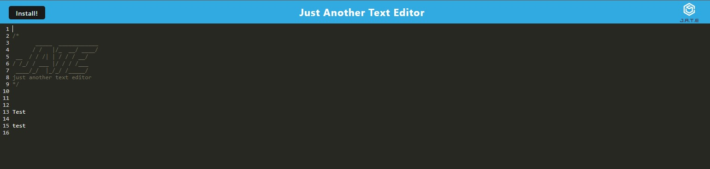

# CW-TextEditor

## Table of Contents 
            
<a href="#description"> 1. Description</a>  

<a href="#install"> 2. Installation </a>

<a href="#contributing"> 3. Contributing </a>

<a href="#test"> 4. Screenshots </a>

## Description <h1 id='description'> </h1>

This is a project for my UCF Full Stack bootcamp. The app will be a single-page application that meets the PWA criteria. Additionally, it will feature a number of data persistence techniques that serve as redundancy in case one of the options is not supported by the browser. The application will also function offline. 

To build this text editor, you will start with an existing application and implement methods for getting and storing data to an IndexedDB database. You will use a package called idb, which is a lightweight wrapper around the IndexedDB API. It features a number of methods that are useful for storing and retrieving data, and is used by companies like Google and Mozilla.

View the live deployment on Heroku here: [Heroku](https://dry-castle-37846.herokuapp.com/)
    
## Installation <h1 id='install'></h1>
          
Feel free to visit this repository and grab the code to make it your own: 
    
## Contributing <h1 id='contributing'></h1>
          
If you would like to learn more about this text editor, please reach me at Cole.Webster@gmail.com
    
## Screenshots <h1 id='test'></h1>

This is a live view of the application on desktop    

 
This is a live view on mobile

The app is availble for use offline

